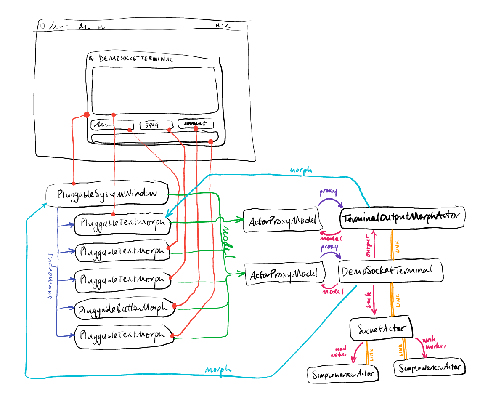

The library offers some support for using an actor as a *model* for
`Morph`s in Squeak's
[Morphic GUI systems](http://wiki.squeak.org/squeak/morphic).

A `Morph` can be configured to use an
[`ActorProxyModel`](#actorproxymodel) as its model, meaning that when
information is needed from the model for UI display and interaction,
requests are sent to an actor.

{:. class="warning"}
Morphic support is experimental.

{:. class="helpwanted"}
I am a novice when it comes to Morphic programming. I am no doubt
making incorrect assumptions about how it is supposed to work. I'd
very much appreciate some help in improving the interaction between
Morphic and actors.

### Challenges in integrating Morphic with Actors

Morphic really isn't set up for an actor-style approach to concurrency.

The main problem is that morphs and model objects **must run in the UI
process**, because some of the interplay between morphs and their
models is synchronous.

#### Dependents protocol

In particular, there's the back-and-forth dance between `changed:` and
`update:` that one must remain painfully aware of.

Normal Morphic models use `changed` to cause a synchronous
notification to be delivered to dependents (i.e. morphs), in the form
of calls to their `update:` methods. This causes problems for using an
actor as a model in two ways:

 1. The call to `update:` has to happen on the UI process, while the
    call to `changed` must run on the actor's own process.
 2. The calls to `update:` cannot be synchronous in an actor system,
    because the view may wish to call back into the actor to read its
    updated state, and if the actor is blocked waiting for a reply to
    the `update:` message, deadlock will occur.

#### Synchronous UI actions

{:. class="warning"}
It is quite easy to lock up the user interface while developing. The
interrupt key (`Alt-.`) is helpful when this happens. However, don't
rely on it: from time to time you will simply have to kill and restart
your VM. **Save often.**

Model callbacks invoked by morphs are synchronous, waiting for an
answer from the model before the UI becomes responsive again. For
example, clicking on a `PluggableButtonMorph` causes an "action"
selector to be invoked on the morph's model, and the UI pauses until
that call returns.

A similar, simpler example is the kind of lockup that can occur if you
run a blocking do-it in a Workspace. For example, the following
creates a new actor, and immediately invokes its `halt` method in the
actor's process. The UI process then waits for the reply. Because the
code uses `blocking`, the UI process will wait forever for the
`Promise` to be resolved.

```smalltalk
ActorBehavior spawn blocking halt.
```

However, the implementation of `halt` queues a request to the UI
process to open a debugger—but the UI process is waiting for the actor
to finish before it checks its work queue.

Pressing `Alt-.` interrupts the wait, bringing up a debugger on the
do-it and allowing the actor's `halt` debugger to open.

In addition, I have implemented heuristic support for preemptively
interrupting the UI process when a `halt` happens in a situation where
it is likely that the UI process is waiting for the thing that has
`halt`ed.

{:. class="implementation-note"}
Perhaps (post-hoc: following the logic that exceptions traverse links)
a `halt` should *halt all causally dependent processes as well*?
Ultimately, new tooling will be needed to properly show the
*branching* contexts that arise once there are cross-process
dependencies.

### Example

Class `DemoSocketTerminal` implements a simple TCP/IP terminal program
that can connect to an arbitrary host and port. Input from the server
is displayed in the main panel, and input from the user is accepted in
the lower input text field.


The implementation of `DemoSocketTerminal` relies on a component
called `TerminalOutputMorphActor`, which backs a `PluggableTextField`
with an actor. That actor in turn accepts `appendText:` messages. A
`TerminalOutputMorphActor` is the implementation of the main panel in
each `DemoSocketTerminal`.



In the diagram above, on the left we see ordinary Morphic structure,
with a `PluggableSystemWindow` having five submorphs. Four of those
submorphs, and the window itself, have an `ActorProxyModel` connected
to the `DemoSocketTerminal` actor as their model. The remaining morph,
the large output panel, has an `ActorProxyModel` connected to the
`TerminalOutputMorphActor` as its model.

When connected, the `DemoSocketTerminal` has an associated
`SocketActor` in its `sock` instance variable, which in turn has a
pair of worker actors for performing blocking reading and writing
actions.

The double orange lines in the diagram denote
[links](links-and-monitors.html#links) between actors. When any actor
dies, all the actors linked to it are terminated automatically.

Actors inheriting from [`MorphActor`](#morphactor), as both
`TerminalOutputMorphActor` and `DemoSocketTerminal` do, enjoy a
[`postExitCleanup:`](processes.html#cleaning-up-associated-resources)
method which `abandon`s their associated morph. Hence, if the
`DemoSocketTerminal` actor terminates, its window is automatically
closed.

### ActorProxyModel

`ActorProxyModel` is a subclass of `Model`, part of the Morphic user
interface framework.

Its purpose is to act as a *model* for a morph, relaying Morphic
callbacks to an actor, thus reconciling the tension between Morphic
models needing to be run in the UI process and Actors running in
separate processes.

Instances of `ActorProxyModel` are normally constructed by instances
of `MorphActor`.

The approach of using an `ActorProxy` (or a
`BlockingTransientActorProxy`) as the model for a morph fails for a
few reasons:

 1. an `ActorProxy` returns `Promise`s for callback invocations, which
    Morphic is not expecting;
 2. a terminated `Actor` invoked via its `ActorProxy` yields `Promise`
    rejections and signalled `BrokenPromise` exceptions, which Morphic
    doesn't expect; and
 3. a `BlockingTransientActorProxy` waits forever for a reply, which
    can lead to UI deadlock.

These reasons motivate the existence of `ActorProxyModel`. Instances
of `ActorProxyModel` directly handle reasons 1 and 3 by way of their
`proxySend:` method, and handle reason 2 by way of their `proxyStub:`
method and related functionality.

#### Relationship between ActorProxyModel and its Actor

Every `ActorProxyModel` holds an `ActorProxy` for its actor in its
`proxy` instance variable.

Furthermore, every `ActorProxyModel` installs itself as a dependent of
its actor, via `proxy addDependent: self`. When the actor calls
`changed` on itself, this will trigger the `ActorProxyModel`'s
`update` methods.

In turn, the `update:` and `update:with:` methods on `ActorProxyModel`
are relayed to its own `changed:` and `changed:with:` methods,
relaying the change notification to the dependents of the
`ActorProxyModel`, such as its associated morphs.

#### Synchronous requests to the actor

When morphic calls methods on the actor, it blocks waiting for the
reply. In order to avoid some cases of UI lockup, by default
`ActorProxyModel` makes such calls with a five-second timeout.

#### Stub behavior after actor termination

In some cases, it is necessary for an `ActorProxyModel` to respond to
requests after its associated actor has terminated. Actors may install
an ad-hoc dictionary of behavior by calling `ActorProxyModel >>
#proxyStub:`. Following a call to `proxyStub:`, the `ActorProxyModel`
will no longer invoke its actor, instead preferring to call blocks in
the ad-hoc dictionary to respond to morphic model methods.

An example of this can be seen in senders and implementors of
`MorphActor >> #buildProxyStub`.

### MorphActor

`MorphActor` is an Actor behavior responsible for acting as a model to
a Morph, mediated by the `ActorProxyModel` held in the `model`
instance variable.

A `MorphActor`'s associated Morph(s) have `model` as their model. The
`model` then delegates their requests to the `MorphActor`, taking care
of timeouts, promises, and so forth.

Subclass `MorphActor` to add application-specific functionality. For
example, both `DemoSocketTerminal` and `TerminalOutputMorphActor` are
subclasses of `MorphActor`.

Subclasses should implement:

 - `buildSpecWith:` (mandatory), to produce a build specification for
   constructing their main Morph. See `MorphActor >> #open` for the
   use of `buildSpecWith:`.
 - `customizeMorph:builtWith:` (optional), to invoke methods on
   newly-constructed morphs that were not catered for in the
   pluggable-spec API.
 - `buildProxyStub` (optional), to provide custom behavior in case the
   actor terminates but morphic still needs to access the model in the
   moments before the view is destroyed.

The `postExitCleanup:` method of `MorphActor` destroys its main Morph
when the actor terminates.
