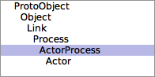

{: class="floatright inline"}
Each Actor is a Smalltalk Process. There are two important subclasses
of Process: `ActorProcess`, which implements the plain Erlang-style
process model; and `Actor`, which goes a step further, adding a
convention for using `Message` objects for RPC, the use of objects as
actor [behaviors](behaviors.html).

{:. class="note"}
Most programs will use [`Actor`](#actor-concurrent-smalltalk-objects)
rather than `ActorProcess`.

## ActorProcess: Erlang-style processes

Instances of `ActorProcess` implement a "process style" actor, in the
terminology of
[De Koster et al.](http://soft.vub.ac.be/Publications/2016/vub-soft-tr-16-11.pdf)
Specifically, they implement a subset of the Erlang approach to the
actor model, providing

 - a main process routine;
 - a "receive" operation;
 - a form of selective receive;
 - distinct *system-level* and *user-level* messages; and
 - Erlang-style ["links" and "monitors"](links-and-monitors.html).

{:. class="warning"}
**No process isolation is implemented.** All Smalltalk objects coexist
in a single mutable shared heap. This means that it is very easy to
accidentally pass mutable objects between actors.
[See below.](#weaknesses-of-the-design)

### The main process routine

A plain `ActorProcess` (as opposed to an `Actor`) is started with
`ActorProcess class >> #boot:` and friends:

```smalltalk
a := ActorProcess boot: [ "... code ..."
                          msg := ActorProcess receiveNext.
                          "... more code ..." ].
a sendMessage: 'Hello!'.
```

Like any other `Process`, an `ActorProcess` can be `terminate`d.
Unlike plain `Process` instances, however, an `ActorProcess` can also
be `kill`ed, which is a special form of a call to `terminateWith:`.
See the sections on [error handling](error-handling.html) and
[links and monitors](links-and-monitors.html) for more information on
the differences between these variants.

### System-level and user-level messages

Messages exchanged among `ActorProcess` instances come in two kinds:
*system*- and *user*-level.

System-level messages are a private implementation detail. They manage
things like links and monitors, and a specific type of system-level
message carries user-level messages back and forth.

{:. class="implementation-note"}
See senders of `performInternally:` to discover the types and uses of
system-level messages. System messages are comparable to (and inspired
by)
[Erlang's system messages](http://erlang.org/doc/design_principles/spec_proc.html#id80464).

User-level messages are the things sent by `ActorProcess >>
sendMessage:` and received by `ActorProcess class >> #receiveNext`.
They are a public aspect of working with Actors.

{:. class="note"}
Programmers design their Actors in terms of the exchange of user-level
messages, and never in terms of system-level messages.

While any object can be sent as a user-level message between Actors,
the convention is that instances of `ActorRequest` are the only kind
of user-level message exchanged.
[More on `ActorRequest` appears below.](#actorrequest)

### "Internal" and "External" protocols

Unlike ordinary Smalltalk objects, which have public methods and
private methods, `ActorProcess` instances have *three* kinds of
method:

 - public, "external" methods, for use by *other* actors and processes;
 - public, "internal" methods, for use *only* by the actor itself;
 - and ordinary private methods, part of the actor system implementation.

External methods include `sendMessage:`, `kill`, `terminate`,
`isActor` and so on. Internal methods include `receiveNext`,
`receiveNextOrNil:`, and `receiveNextTimeout:`.

## Actor: Concurrent Smalltalk objects

I extend ActorProcess with the notion of a distinct behavior object. My user-level request messages are to be ActorRequest instances bearing Message instances. I respond to user-level request messages by performing them at my behavior object, and sending the results back to the calling actor.

Instance Variables
	behavior:		my behavior object. May be any object, but ActorBehavior is a convenient subclass.
	currentRemoteContinuation:		non-nil initially during execution of a behavior method. See #caller
	pendingContinuations:		Set of ActorRequests that haven't been replied to yet, that this actor is obliged to reply to at some point in the future. See #finishRequest: and ActorRequest>>#redirectTo:message:.

### ActorRequest

## Weaknesses of the design

 - hack to change returning self to returning self proxy
 - no translation of blocks, hence custom control flow will be weird.
   Perhaps something (inefficient?) can be done about that
 - no isolation!!! this is really important - you still end up having
   to worry about concurrent access to data structures. Witness: the
   "copy" call in the chat room code

```smalltalk
b := Actor bootProxy: [ true ].
(b ifTrue: [ 1 ] ifFalse: [2]) wait
" ^ Wow, this doesn't work. Invokes mustBeBoolean. This is leaking some of the optimization-enabling assumptions the VM makes."
```

(See also usage of blocks in `OrderedCollection` and `Dictionary` examples <http:tutorial-collection.html>)

## Related work

Interesting to also look at and think about:

    Installer squeakmap update; install: 'Actalk'

<http://citeseerx.ist.psu.edu/viewdoc/download?doi=10.1.1.41.2445&rep=rep1&type=pdf>

Apparent differences (though I have only a shallow understanding):

 - we use `Process` subclassing
 - we use `Promise`s in a pervasive convention for RPC to `Actor`s
 - we allow any object to be the behavior of an `Actor`
 - we offer links and monitors
