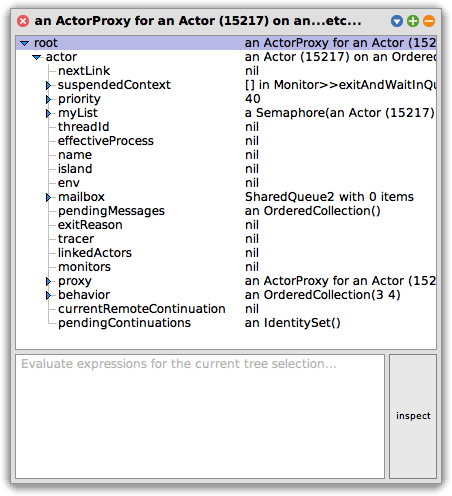
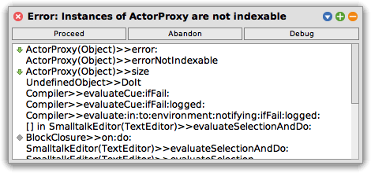
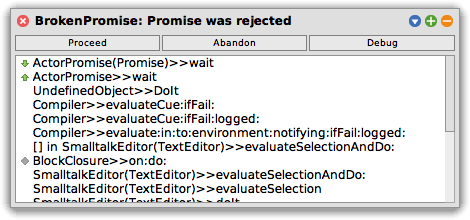

This tutorial covers use of ordinary Smalltalk objects not inheriting
from [`ActorBehavior`](behaviors.html) as behavior objects for
[`Actor`](processes.html#actor-concurrent-smalltalk-objects) process
instances. It focuses primarily on the problems that might arise in
such situations.

### An OrderedCollection actor

Let's experiment with using an `OrderedCollection` as behavior for an
Actor.

```smalltalk
a := Actor bootProxy: [ OrderedCollection new ].
```

We are now able to send messages to our actor, as usual:

```smalltalk
a add: 3.
a add: 4.
```

If we explore our actor using "explore it" on `a` in our workspace, we
see the state of the actor is as follows:



As expected, we see `an OrderedCollection(3 4)` as the behavior
object.

Interactions with actors default to asynchronous:

```smalltalk
a sum. "a Promise"
```

But we can wait for them to complete as usual if we like:

```smalltalk
a sum wait. "7"
```

However, a surprise is in store for us if we try to ask for the `size`
of the `OrderedCollection`.

```smalltalk
a size.
```



What is happening here is that `ActorProxy` inherits from `Object`,
which implements `size`. Instead of forwarding our request to the
`Actor` (and hence to its behavior), the `ActorProxy` tried to answer
`size` itself.

This is one of the reasons for the different
[interaction patterns](proxies.html#interaction-patterns) that
`ActorProxy` objects offer. Use of
[`sync`](proxies.html#synchronous-rpc) here allows us to ensure the
request is forwarded to the `Actor` correctly.

```smalltalk
a sync size wait. "2"
```

Other methods that trigger this class of difficulty include `at:` and
`at:put:`, along with all the other methods defined on class `Object`.

Another surprise lies in wait when it comes to *exceptions* signaled
by an object as part of its normal interface.

Running `removeFirst` twice works just fine. The third request will
signal an empty collection error:

```smalltalk
a removeFirst wait. "3"
a removeFirst wait. "4"
a removeFirst wait. "(results in the following window)"
```



Clicking on "Debug" allows us to find out what went wrong. In the
lower-left panel on the debugger, when the topmost
(`ActorPromise(Promise)>>wait`) context is selected, is an `error`
variable. Selecting that variable shows the underlying error in the
adjacent panel:

.png)

The main takeaway from this is that, since the behaviour object of the
actor signaled an uncaught exception, **the entire actor has been
terminated** and is no longer able to reply to requests.

If we ask for its `sum` again, we're notified that the actor has
terminated, with the "collection is empty" exception that caused it to
stop.

At this point, there is no recovery; termination of an actor is final.

### A Dictionary actor

Similarly, we can try using a `Dictionary` as an actor's behavior
object.

```smalltalk
d := Actor bootProxy: [ Dictionary new ].
d async at: 1 put: 2. "nil"
d async at: 3 put: 4. "nil"
```

As before, ordinary methods work just fine.

To avoid the problems with exceptions as part of an object's normal
interface, we can avoid those parts of the interface, and instead use
alternatives that allow us to execute specific pieces of code when
otherwise an exception would be signalled:

```smalltalk
(d at: 1 ifAbsent: [ Actor callerError: 'No such key' ]) wait. "2"
(d at: 11 ifAbsent: [ Actor callerError: 'No such key' ]) wait. "an error"
(d removeKey: 1 ifAbsent: [ Actor callerError: 'No such key' ]) wait. "works once..."
(d removeKey: 1 ifAbsent: [ Actor callerError: 'No such key' ]) wait. "...but not twice."
```

By using `Actor class >> #callerError:`, we avoid having an uncaught
exception be thrown. Instead, only the promise associated with the
request is rejected, causing a `BrokenPromise` exception in the
caller, but leaving the `Dictionary` actor itself unharmed. Sending
future requests to the dictionary actor will continue to work.

Our strategy of using methods like `at:ifAbsent:` instead of `at:`,
and `removeKey:ifAbsent:` instead of `removeKey:`, has allowed us to
avoid killing the whole actor, but at the cost of having the
`ifAbsent:` block execute *in the wrong context*. That is, if it runs,
it will run in a context where `self` is the `Dictionary`, and `Actor
current` and `Actor me` denote the actor that the client knows as `d`.


