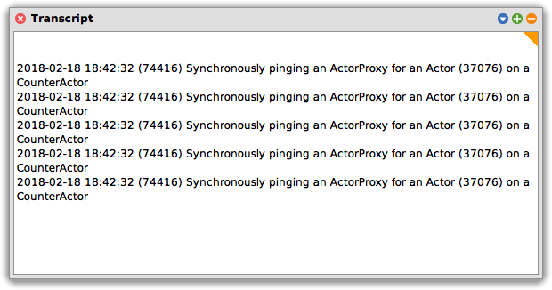
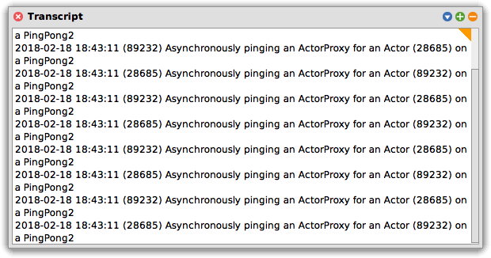

This tutorial introduces different
[interaction patterns](proxies.html#interaction-patterns) by way of
two peers exchanging messages in a back-and-forth, "ping-pong"
pattern.

It also touches on [linking](links-and-monitors.html) actors together.

### Synchronous version

Our first example will "ping-pong" back and forth between two actors.
The "ping" step will be a *request* from a `PingPong1` to a
`CounterActor` (from the [previous tutorial](tutorial-counter.html)),
and the eventual *reply* from the `CounterActor` to the `PingPong1`
will be the "pong" step.

#### Defining our behavior class

We do not need any instance variables for our `PingPong1` actor. It is
stateless.

```smalltalk
ActorBehavior subclass: #PingPong1
    instanceVariableNames: ''
    classVariableNames: ''
    poolDictionaries: ''
    category: 'ActorExamples'
```

#### Defining our main method

Invoking `increment: aCounterActorProxy times: anInteger` causes
`anInteger` RPC calls to be issued to `aCounterActorProxy`.

```smalltalk
increment: aCounter times: count
    count = 0 ifTrue: [^self].
    self logAll: 'Synchronously pinging ', aCounter printString.
    aCounter increment >>= [ :incrementedValue |
        self increment: aCounter times: count - 1 ] bindActor.
```

Notice use of the `>>=` operator. Because `aCounter` is a
[proxy](proxies.html), invoking methods on it results in a
[promise](promises.html). The `>>=` operator on a promise adds a
*continuation* to it: when the promise is eventually resolved, the
continuation is invoked with the resolved value of the promise. The
call to `bindActor` on the continuation block ensures that the code
inside it will run in the context of the `PingPong1` actor.

It looks like the code is making a recursive call to itself, but this
is not what is happening, and you will not see more than a single
`increment:times:` context on the `PingPong1` actor's stack at once.

After `>>=` finishes attaching the continuation block to the promise
returned by `increment`, the method simply continues executing. Since
it is at the end, it returns `self`, as usual for Smalltalk.

This means that the original call to `increment:times:` completes well
before the resulting chain of ping-pong RPC calls has finished. By
attaching a continuation to a promise and allowing the main thread of
execution to continue, the actor returns to responding to new
requests, even while a "background" task is continuing in some other
actor.

#### Running the example

First, create the two actors that will interact with each other:

```smalltalk
actor1 := PingPong1 spawn.
actor2 := CounterActor spawn.
```

Now, open a Transcript window. Then, start the interaction:

```smalltalk
actor1 increment: actor2 times: 5.
```

You should see output like the following in your Transcript.



Finally, terminate the two actors:

```smalltalk
actor1 actor terminate.
actor2 actor terminate.
```

### Asynchronous version

Our second example will be similar to the first, but will use
asynchronous, one-way messages instead of synchronous RPC. The "ping"
and "pong" steps will be symmetrical. Each will be a one-way request
from one `PingPong2` actor to another.

#### Defining our behavior class

Again, our actor is stateless, and needs no instance variables.

```smalltalk
ActorBehavior subclass: #PingPong2
    instanceVariableNames: ''
    classVariableNames: ''
    poolDictionaries: ''
    category: 'ActorExamples'
```

#### Defining our main method

The chief difference between `ping:times:` here and `increment:times:`
above is the use of `async`. A one-way request doesn't return a
promise, since no reply (or exception) will be forthcoming. Also, a
one-way request is asynchronous, so execution continues on after
sending the next message to `peer`, and the method completes normally,
freeing the actor up to handle the next incoming request.

```smalltalk
ping: peer times: count
    count = 0 ifTrue: [^self].
    self logAll: 'Asynchronously pinging ', peer printString.
    peer async ping: Actor me times: count - 1.
```

#### Running the example

First, create the two actors that will interact with each other:

```smalltalk
actor1 := PingPong2 spawn.
actor2 := PingPong2 spawn.
```

Now, open a Transcript window. Then, start the interaction:

```smalltalk
actor1 ping: actor2 times: 10.
```

You should see output like the following in your Transcript.



Finally, terminate the two actors:

```smalltalk
actor1 actor kill.
actor2 actor kill.
```

### Linking

We can arrange for our two interacting actors to terminate
together—[fate sharing](links-and-monitors.html#handling-link-activation)—by
using the `Actor >> #link` method.

Add the following method to `PingPong2`:

```smalltalk
linkTo: anActorProxy
    anActorProxy actor link.
```

{: .note}
Usually, `link`ing is a private implementation decision of a behavior
object. It is unusual to see outsiders supply actors to link to. The
`linkTo:` method would be unlikely to exist in a real program.

As explained on the page about
[proxies](proxies.html#switching-between-an-actor-and-its-actorproxy),
every actor has a "proxy" that takes care of the details of
marshalling requests to be sent to it, and every proxy has an
associated actor. The main difference between them is that messages
sent to the proxy are converted into [requests](requests.html) and
sent *as inter-actor messages* to the actor, which will then invoke
them on the actor's [behavior object](behaviors.html); whereas
messages sent to the actor, the instance of [`Actor`](processes.html),
will directly trigger behavior on the `Actor` object itself.

If you like, the proxy is the "user-level" object that is for everyday
use interacting with an actor's behavior, and its actor is for
meta-level or reflective operations on actors, interacting with an
actor's *process*.

Here, we want to link two processes together, so that when one
terminates, the other does as well, and so we invoke the `link` method
on an `Actor`. If we had sent `link` to the proxy, it would have
looked for a method called `link` on `anActorProxy`'s behavior object,
which is unlikely to exist.

#### Reprise, with links this time

After creating the actors,

```smalltalk
actor1 := PingPong2 spawn.
actor2 := PingPong2 spawn.
```

we link them to each other:

```smalltalk
actor1 linkTo: actor2.
```

Now, if one dies, so does the other.

Open a process browser, and check to see that both actors are there.
Now, kill `actor1`.

```smalltalk
actor1 actor terminate.
```

Check on the process browser (you may need to refresh it, or turn on
auto-updating), and see that neither of the actors remain.

In your workspace, invoking "print it" on `actor1` and `actor2` will
similarly show that they have both terminated:

```smalltalk
actor1. "an ActorProxy for an Actor (24140) on a PingPong2 (terminated)"
actor2. "an ActorProxy for an Actor (10267) on a PingPong2 (terminated)"
```


